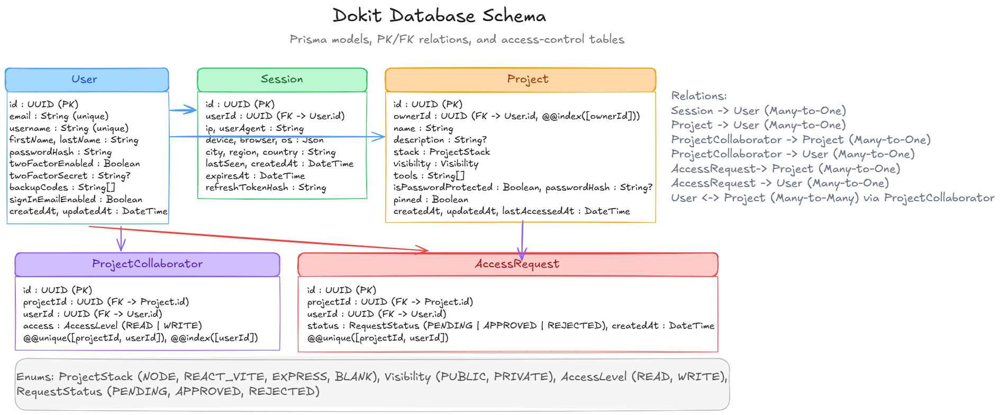
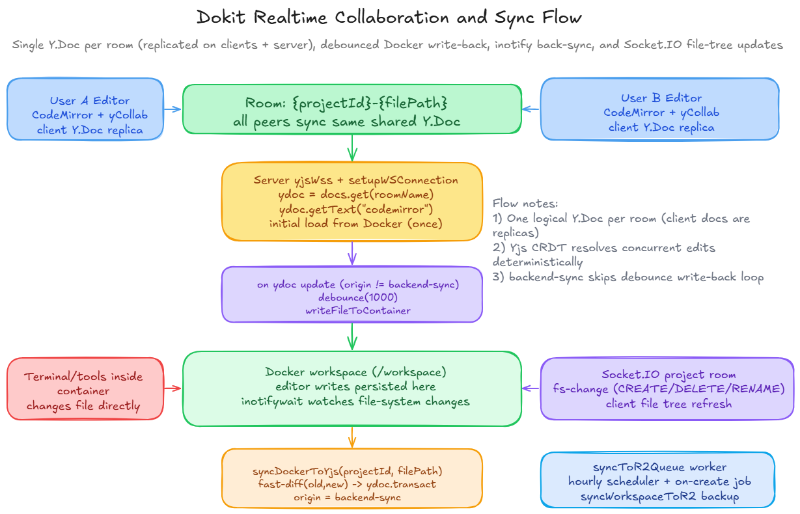

# Dokit

Dokit is a powerful, cloud-like infrastructure, browser-based development workspace engineered for real-time collaboration. It bridges the gap between local development and cloud convenience by combining a Next.js client, an Express backend, Docker-managed project runtimes, and bidirectional object storage synchronization.

## Core Capabilities

- **Cloud Virtualization:** Programmatic provisioning, management, and teardown of isolated Linux environments via the Docker Engine API.
- **Authentication Architecture:** Robust session management architecture utilizing short-lived JWT access tokens and securely rotating refresh tokens, enabling remote session revocation across devices.
**Two-Factor Authentication (2FA):**: Platform is security by a comprehensive TOTP-based 2FA flow, featuring AES-encrypted secrets and backup recovery codes.
- **Advanced Container Sandboxing:** Strict container security achieved by stepping down root privileges to a restricted 'dokituser' via gosu, paired with granular Role-Based Access Control (RBAC).
- **Real-Time Collaboration:** Conflict-free concurrent editing using Yjs (CRDTs) and CodeMirror, featuring live cursors, file-wise and global presence tracking, and multiplayer synchronization over WebSockets.
- **Bidirectional File Synchronization:** Real-time mirroring of container file system changes to the frontend via Linux inotify and Socket.IO, with persistent state backups to Cloudflare R2 managed by BullMQ.
- **GitHub Imports:** End-to-end pipeline that instantly clones public repositories and provisions them into fully interactive, containerized development environments.
- **Dynamic Environment Provisioning:** On-the-fly workspace tooling system allowing users to install backend runtimes (Python, Go, Rust, Java) and terminal utilities seamlessly.
- **Dynamic Proxy & Access Control:** Nginx reverse proxy utilizing wildcard DNS (nip.io) to dynamically route WebSocket terminal sessions and HTTP preview traffic, secured by internal authorization sub-requests.
- **API Security:** Backend infrastructure protected by a Redis-based sliding-window IP rate limiter and strict payload validation.

## Architecture Diagrams

### 1. Database Schema

Prisma data model for users, sessions, projects, collaborators, and access requests.

Source: ./docs/diagrams/dokit_database_schema.excalidraw

### 2. Realtime Collaboration and Sync Flow

Bidirectional synchronization across editors and container filesystem changes, including Yjs room updates and Socket.IO file tree events.

Source: ./docs/diagrams/dokit_realtime_sync_flow.excalidraw

## Technology Stack

### Frontend

- Next.js (React)
- TypeScript
- Redux Toolkit
- CodeMirror
- Yjs

### Backend

- Node.js
- Express
- Prisma ORM
- Socket.IO
- y-websocket

### Infrastructure & Services

- Docker Engine API
- Nginx
- PostgreSQL
- Redis
- BullMQ
- Cloudflare R2
- Rclone

## Project Structure

- **client:** Next.js application, collaborative editor UI, recursive file explorer, and terminal/preview panels.
- **server:** API server, WebSocket servers, background queue workers, Docker orchestration, and R2 synchronization services.
- **docs/diagrams:** Architecture diagram sources and PNG outputs.

## Setup

Use the existing setup instructions already present in this repository (in docs folder) for dependency installation, environment configuration, and run commands.

- Main project overview: ./README.md
- Server setup and scripts: ./server
- Client setup and scripts: ./client