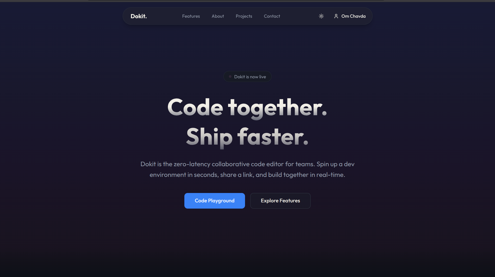

  

<h1 align="center">Dokit</h1>

  <strong>Cloud-native collaborative development workspace</strong>

<!--  -->

  
  

  
  
  
  
  
  
  
  

  
  
  
  
  

## Overview

Dokit is a cloud-native development workspace engineered for real-time collaboration. It eliminates the friction between local development and cloud convenience by providing isolated, containerized environments accessible directly from your browser.

Built with a Next.js frontend, Express backend, Docker-managed runtimes, and bidirectional object storage synchronization, Dokit enables teams to code together in real-time with zero configuration.

---

## Features

### Cloud Virtualization
Programmatic provisioning, management, and teardown of isolated Linux environments via the Docker Engine API. Each workspace runs in its own secure container with limited (/workspace) filesystem access and terminal capabilities.

### Real-Time Collaboration
Conflict-free concurrent editing powered by **Yjs CRDTs** and **CodeMirror 6**. Multiple developers can edit the same file simultaneously with:
 - Live cursors showing collaborator positions
 - File-wise and global presence tracking
 - Multiplayer synchronization over WebSockets
 - Instant conflict resolution

### Advanced Container Sandboxing
Defense-in-depth container security:
- Root privilege step-down to restricted `dokituser` via **gosu**
- Granular **Role-Based Access Control (RBAC)** for project collaborators
- READ/WRITE permission levels for fine-grained access management

### Project-Aware AI Assistant (ASTra)
Project context and chat history aware assistant powered by **OpenRouter LLM** and **Retrieval-Augmented Generation (RAG)**:
- **Semantic Code Search** — Embeddings-based retrieval using `nomic-embed-text` via local Ollama for accurate, privacy-first context
- **Code Understanding** — Regex-based parsing pipeline supporting JS, TS, Python, Go, Rust, C/C++ with language-specific chunking strategies.
- **pgvector Integration** — Cosine similarity search over 768-dimensional embeddings stored directly in PostgreSQL
- **MMR Reranking** — Maximal Marginal Relevance reranking for diverse, non-redundant context retrieval
- **Conversation Memory** — Incremental rolling summary persisted per chat thread
- **Multi-chat Support** — Multiple named chat threads per project with auto-generated titles and full message persistence

### Bidirectional File Synchronization
Real-time mirroring between container filesystem and frontend:
- Linux **inotify** watchers detect container-side changes
- **Socket.IO** pushes updates to all connected clients instantly
- Persistent state backups to **Cloudflare R2** managed by **BullMQ** job queues
- Workspace restoration on container restart

### GitHub Integration
End-to-end pipeline for repository imports:
- Clone any public GitHub repository with one click
- Automatic provisioning into fully interactive containerized environments
- Preserves project structure and dependencies

### Dynamic Environment Provisioning
On-the-fly workspace customization:
- Install backend runtimes: **Python**, **Go**, **Rust**, **Java** etc...
- Add terminal utilities and development tools seamlessly

### Project Templates
Pre-configured starter environments:
-  **Node.js** — Modern JavaScript runtime
-  **React + Vite** — Fast React development with Vite
-  **Express** — Backend API development
-  **FastAPI** — High-performance Python framework
-  **Go API** — Scalable backend in Go
-  **Blank** — Empty canvas for custom setups

### Dynamic Proxy & Access Control
Request routing via **Nginx** reverse proxy:
- Implemented dynamic DNS routing via [port]-[projectId].dokit.backends.live to enable instant preview traffic routing.
- WebSocket terminal session proxying
- HTTP preview traffic routing with live reload
- Internal authorization sub-requests for secure access

### Security
Hardened backend infrastructure:
- **Redis-based sliding-window rate limiter** — IP-based request throttling
- **Zod validation** — Strict payload validation on all endpoints
- **GeoIP tracking** — Session location awareness via MaxMind

### Authentication
Enterprise-grade security infrastructure including:
- **JWT-based Session Management** — Short-lived access tokens with securely rotating refresh tokens
- **Remote Session Revocation** — Invalidate sessions across all devices instantly
- **Two-Factor Authentication (2FA)** — TOTP-based verification with AES-encrypted secrets and backup recovery codes
- **Sign-in Email Notifications** — Optional alerts for new logins

### Project Visibility & Sharing
Flexible access control for projects:
- **Private** — Owner and invited collaborators only
- **Public** — Viewable by anyone, editable and executable by collaborators
- **Password Protection** — Additional layer for sensitive projects
- **Access Requests** — Users can request contributor access to collaborate on public projects.

### Public Profile
Customizable developer introduction and project showcasing:
- **Markdown Profile Pages** Render personalized developer landing pages using a customizable `profile.md` file.
- **Featured Projects** Pin and unpin projects to curate a public developer portfolio.
- **Workspace Exporting** Download entire project (source code) as .zip archives for local execution or backup.

---

## Architecture

### Database Schema

Prisma data model managing users, sessions, projects, collaborators, and access requests.

### Real-Time Collaboration Flow

Bidirectional synchronization across editors and container filesystem changes, including Yjs room updates and Socket.IO file tree events.

### System Architecture

Dokit backend runs on AWS EC2 with a 3-version rolling deployment strategy — every push to main atomically flips a symlink to the new release, with automatic instant rollback to the last stable version if the health check fails.

---

## Tech Stack

### Frontend

| Technology | Purpose |
|------------|---------|
| **Next.js 16** | React framework with App Router and Turbopack |
| **TypeScript** | Type-safe development |
| **Redux Toolkit** | Global state management with persistence |
| **CodeMirror 6** | Extensible code editor with syntax highlighting |
| **Yjs** | CRDT-based real-time collaboration |
| **xterm.js** | Terminal emulator in the browser |
| **Socket.IO Client** | Real-time bidirectional communication |
| **Tailwind CSS 4** | Utility-first styling |
| **Radix UI** | Accessible component primitives |
| **Shadcn UI** | Tailwind-based component library |
| **Lucide Icons** | Beautiful icon library |

### Backend

| Technology | Purpose |
|------------|---------|
| **Node.js** | JavaScript runtime |
| **Express 5** | Web framework for REST API |
| **PostgreSQL** | Primary database |
| **Prisma ORM** | Type-safe database client |
| **BullMQ** | Background job queue (email, sync projects, delete project, etc.) |
| **Redis** | Caching, rate limiting, job queues |
| **Socket.IO** | Real-time event broadcasting |
| **y-websocket** | Yjs WebSocket provider |
| **Zod** | Runtime schema validation |
| **Argon2** | Password hashing |
| **JWT** | Token-based authentication |
| **otplib** | TOTP 2FA implementation |
| **Pino** | High-performance logging |
| **ua-parser** | User agent parsing |

### DevOps & Tooling

| Technology | Purpose |
|------------|---------|
| **Docker Engine API** | Container orchestration |
| **Nginx** | Reverse proxy with wildcard DNS |
| **Cloudflare R2** | S3-compatible object storage |
| **GitHub Actions** | CI/CD pipeline (prettier + lint checkes and deployment) |
| **PM2** | Process manager |
| **Rclone** | Cloud storage synchronization |
| **MaxMind GeoIP** | IP geolocation for sessions |

---

## Directory Structure
Please refer to file **[DIRECTORY_STRUCTURE.md](./docs/DIRECTORY_STRUCTURE.md)** for full overview of Project file structure

---

## Security Considerations

### Authentication
- Passwords hashed with **Argon2**
- Access tokens expire in 15 minutes
- Refresh tokens rotate on each use
- Session binding to device fingerprint

### Container Isolation
- Non-root user execution inside containers
- Resource limits (CPU, memory, disk)
- Network isolation between user projects and application services
- Read-only base filesystem with writable workspace overlay

---

## Getting Started

### Prerequisites
  - **Docker Engine** installed and running
  - **Node.js** >= 20
  - **pnpm** >= 10

> For detailed setup instructions, refer to **[SETUP.md](./docs/SETUP.md)**.

---

## License

This project is open source and available under the [MIT License](LICENSE).

