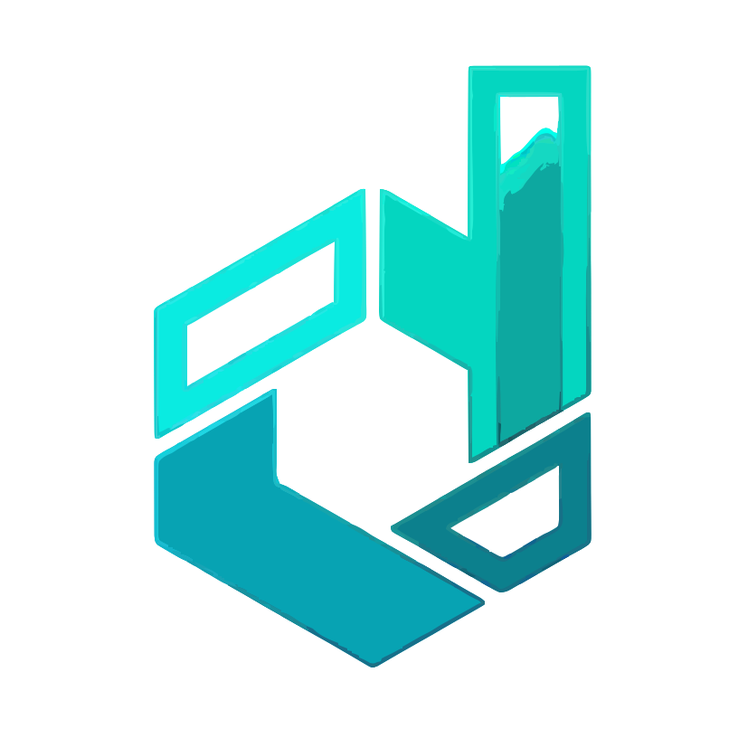
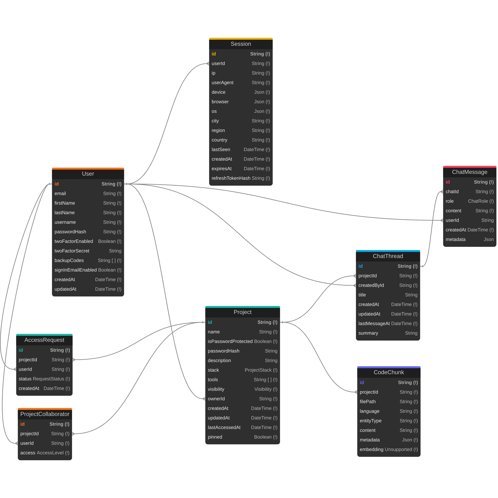
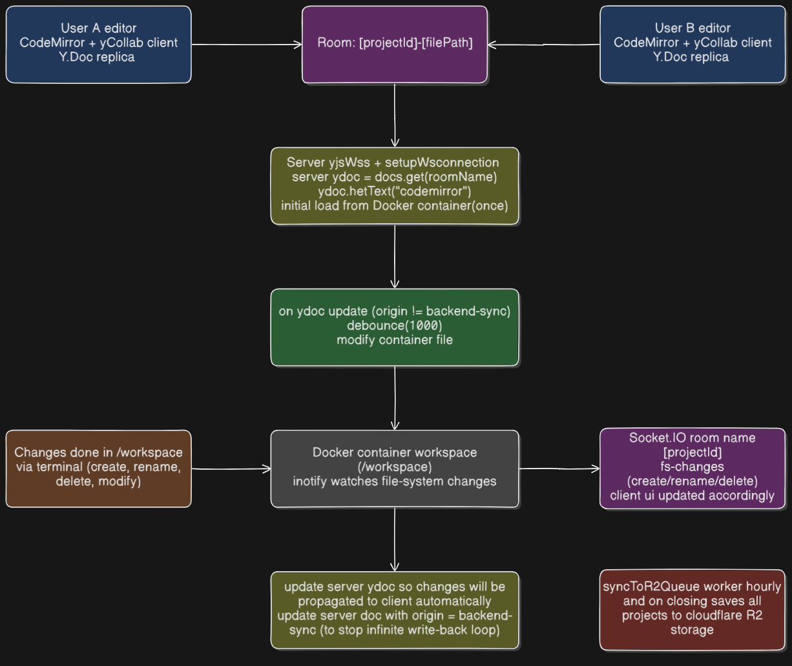
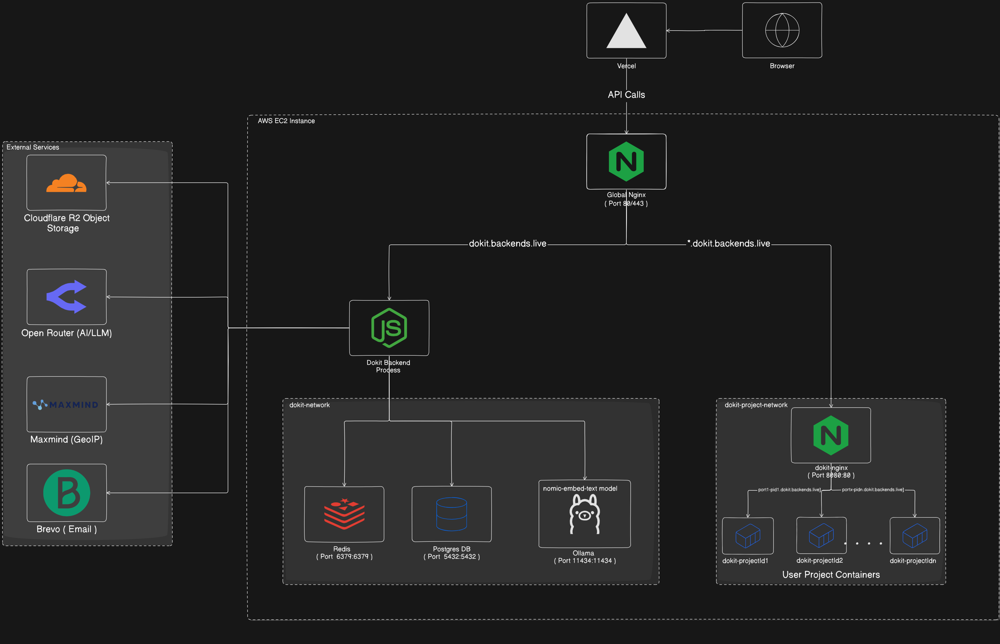

  

<h1 align="center">Dokit</h1>

  <strong>Cloud-native collaborative development workspace</strong>

  
  

  
  
  
  
  
  
  
  

  
  
  
  
  

---

Dokit is a cloud-native collaborative development platform that provisions isolated, containerized environments in the browser. Build, edit, and run code with real-time multiplayer synchronization, a project-aware AI assistant, and instant preview routing.

It eliminates the friction between local development and cloud convenience by providing secure, Docker-managed runtimes coupled with bidirectional object storage synchronization and a powerful collaborative workspace.

---

## Table of Contents

- [Overview](#overview)
- [Key Features](#key-features)
- [Getting Started](#getting-started)
- [System Architecture](#system-architecture)
  - [Database Schema](#database-schema)
  - [Real-Time Synchronization Flow](#real-time-synchronization-flow)
  - [Deployment & System Architecture](#deployment--system-architecture)
- [Tech Stack](#tech-stack)
  - [Frontend](#frontend)
  - [Backend](#backend)
  - [DevOps & Tooling](#devops--tooling)
- [Security Considerations](#security-considerations)
  - [Authentication](#authentication)
  - [Container Isolation](#container-isolation)
- [Directory Structure](#directory-structure)
- [License](#license)

---

## Overview

Dokit brings the speed of the cloud to local development, allowing team members to code concurrently on the same codebase. By executing code runtimes inside sandboxed Docker containers, Dokit lets developers spin up templates, import repositories from GitHub, and share preview links instantly with team members. State persistence is managed seamlessly in the background, syncing workspace folders with Cloudflare R2 on every write event and automatically backing up containers for persistent, stateful sessions.

---

## Key Features

### 1. Cloud Runtimes & Container Sandboxing
* **On-Demand Linux Containers**: Provision and tear down isolated Linux environments dynamically via the Docker Engine API.
* **Secure Sandbox Isolation**: Run workspace containers under a restricted, non-root `dokituser` using `gosu` with limited (`/workspace`) filesystem access.
* **Dynamic Environment Customization**: Install backend runtimes (Python, Go, Rust, Java) and CLI utilities on the fly from the workspace terminal.
* **Fine-Grained RBAC**: Enforce project-level Role-Based Access Control (RBAC) with read/write access permissions mapping collaborators.

### 2. Real-Time Collaboration & Sync
* **Multiplayer Code Editing**: Edit code concurrently with conflict-free workspace integration powered by Yjs CRDTs and CodeMirror 6.
* **Collaborator Presence**: Track live cursors, active selections, and global member presence over WebSockets.
* **Bidirectional File Syncing**: Synchronize filesystem updates instantly between the container and the web editor via Linux `inotify` and Socket.IO.
* **Background Cloud Sync**: Persist workspace changes automatically to Cloudflare R2 using BullMQ background job queues, ensuring seamless workspace recovery on container restarts.

### 3. Project-Aware AI Assistant (ASTra)
* **Retrieval-Augmented Generation (RAG)**: Search and explain codebases contextually using local Ollama embeddings (`nomic-embed-text`) and pgvector similarity search.
* **Multi-Language AST Parsing**: Chunk codebases intelligently using regex-based language-specific parsing pipelines supporting JS, TS, Python, Go, Rust, and C/C++.
* **Maximal Marginal Relevance (MMR)**: Re-rank search results dynamically to retrieve diverse, relevant context.
* **Incremental Chat History**: Maintain multi-turn developer chat history with automated chat thread summarization and persistence.

### 4. Developer Workflows & Templates
* **One-Click GitHub Import**: Import and auto-provision any public GitHub repository directly into an interactive development workspace.
* **Project Templates**: Spin up pre-configured environments for Node.js, React (Vite), Express, FastAPI, Go API, or Blank projects.
  *  **Node.js** — Modern JavaScript runtime
  *  **React + Vite** — Fast React development with Vite
  *  **Express** — Backend API development
  *  **FastAPI** — High-performance Python framework
  *  **Go API** — Scalable backend in Go
  *  **Blank** — Empty canvas for custom setups
* **Public Developer Profiles**: Render developer portfolios from a customizable `profile.md` with featured projects.
* **Workspace Exporting**: Download entire workspace folders as `.zip` archives for local backups or offline execution.
* **Access Request Management**: Users can request contributor access to collaborate on public projects.

### 5. Dynamic Routing & Networking
* **Wildcard Preview Domains**: Route HTTP preview traffic dynamically to running dev servers via Nginx (`[port]-[projectId].dokit.backends.live`).
* **Secure Proxying**: Proxy terminal WebSocket sessions and preview HTTP requests with internal authorization sub-requests.

### 6. Hardened Security & Authentication
* **Two-Factor Authentication (2FA)**: Secure accounts with TOTP verification using AES-encrypted secrets and backup recovery codes.
* **Robust Session Management**: Use short-lived JWT access tokens with secure rotation and instant, remote session revocation.
* **Infrastructure Throttling**: Protect API endpoints using a Redis-based sliding-window rate limiter and strictly validate payloads via Zod.
* **Access Auditing**: Monitor session locations via MaxMind GeoIP and trigger optional sign-in notification emails.
* **Project Visibility**: Share projects with Public, Private, or Password-Protected visibility states.

---

## Getting Started

Please refer to **[SETUP.md](./docs/SETUP.md)** for detailed local environment installation and configuration instructions.

---

## System Architecture

### Database Schema

Prisma data model managing users, sessions, projects, collaborators, and access requests.

### Real-Time Synchronization Flow

Bidirectional synchronization across editors and container filesystem changes, including Yjs room updates and Socket.IO file tree events.

### Deployment & System Architecture

Dokit backend runs on AWS EC2 with a 3-version rolling deployment strategy — every push to main atomically flips a symlink to the new release, with automatic instant rollback to the last stable version if the health check fails.

---

## Tech Stack

### Frontend

| Technology | Purpose |
|------------|---------|
| **Next.js 16** | React framework with App Router and Turbopack |
| **TypeScript** | Type-safe development |
| **Redux Toolkit** | Global state management with persistence |
| **CodeMirror 6** | Extensible code editor with syntax highlighting |
| **Yjs** | CRDT-based real-time collaboration |
| **xterm.js** | Terminal emulator in the browser |
| **Socket.IO Client** | Real-time bidirectional communication |
| **Tailwind CSS 4** | Utility-first styling |
| **Radix UI** | Accessible component primitives |
| **Shadcn UI** | Tailwind-based component library |
| **Lucide Icons** | Beautiful icon library |

### Backend

| Technology | Purpose |
|------------|---------|
| **Node.js** | JavaScript runtime |
| **Express 5** | Web framework for REST API |
| **PostgreSQL** | Primary database |
| **Prisma ORM** | Type-safe database client |
| **BullMQ** | Background job queue (email, sync projects, delete project, etc.) |
| **Redis** | Caching, rate limiting, job queues |
| **Socket.IO** | Real-time event broadcasting |
| **y-websocket** | Yjs WebSocket provider |
| **Zod** | Runtime schema validation |
| **Argon2** | Password hashing |
| **JWT** | Token-based authentication |
| **otplib** | TOTP 2FA implementation |
| **Pino** | High-performance logging |
| **ua-parser** | User agent parsing |

### DevOps & Tooling

| Technology | Purpose |
|------------|---------|
| **Docker Engine API** | Container orchestration |
| **Nginx** | Reverse proxy with wildcard DNS |
| **Cloudflare R2** | S3-compatible object storage |
| **GitHub Actions** | CI/CD pipeline (prettier + lint checks and deployment) |
| **PM2** | Process manager |
| **Husky** | Git hooks (pre-commit format and lint checks) |
| **Prettier and ESLint** | Code formatting and quality assurance |
| **Rclone** | Cloud storage synchronization |
| **MaxMind GeoIP** | IP geolocation for sessions |

---

## Security Considerations

### Authentication
* Passwords hashed using **Argon2**.
* Access tokens expire in 15 minutes.
* Refresh tokens rotate on every refresh API request.
* Once a invalid refresh token is detected, all sessions of that user are revoked.

### Container Isolation
* Runs non-root users (`dokituser`) inside containers.
* Enforces hard limits on CPU, memory, and disk utilization.
* Insulates user projects from backend system networks.
* Mounts read-only base layers with a writeable project workspace overlay.

---

## Directory Structure

Please refer to **[DIRECTORY_STRUCTURE.md](./docs/DIRECTORY_STRUCTURE.md)** for a full overview of the project's file structure.

---

## License

This project is open source and available under the [MIT License](LICENSE).
